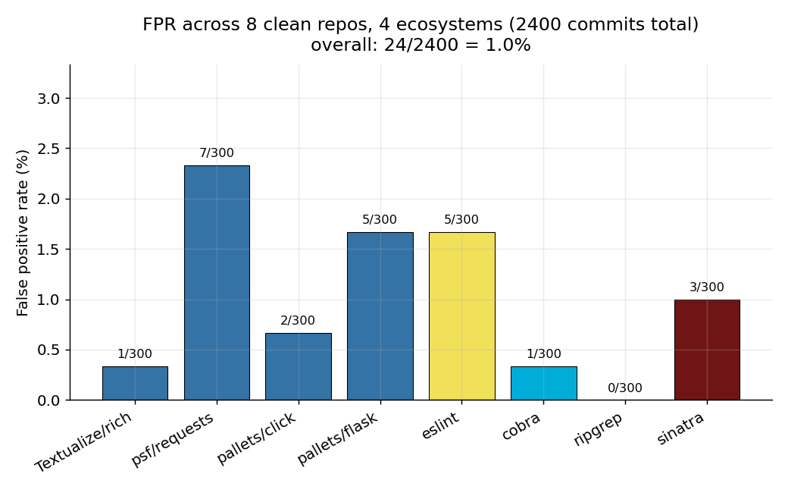
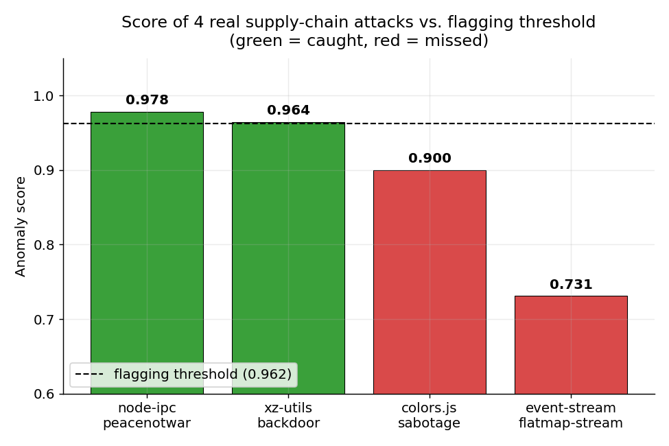
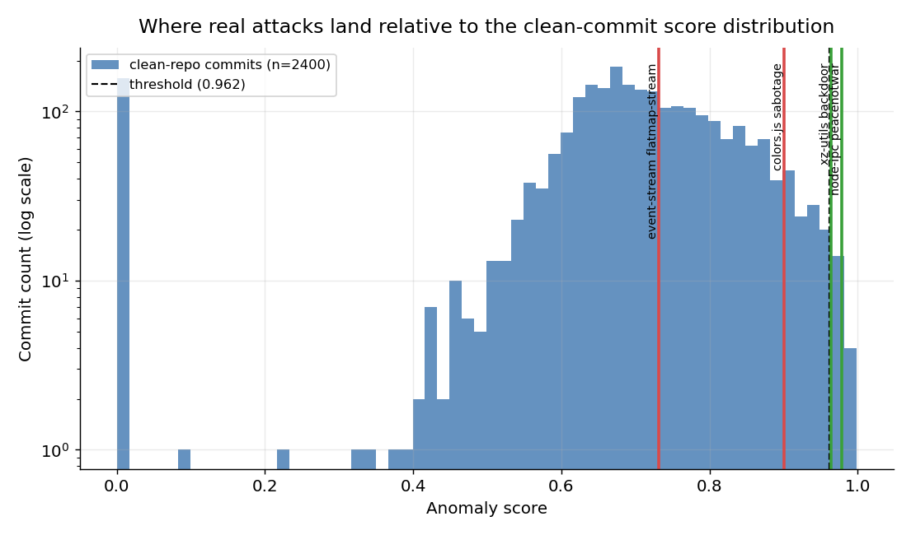

# unusual-commit-scanner

Flags anomalous git commits that look like supply-chain sabotage — a Python port of
[goyalr41/UnusualGitCommit](https://github.com/goyalr41/UnusualGitCommit) (originally Java +
servlet UI + Chrome extension), extended with statistical fixes, natural-language explanations,
and several detection heuristics ported from [DataDog/guarddog](https://github.com/DataDog/guarddog).

## What it does

For each commit in a repo's history, it scores how unusual the commit is against:

- **Statistical rarity** — LOC added/removed, files touched, commit message length, hour-of-day
  and day-of-week (via circular KDE, not a power-law tail), inter-commit gaps, add:remove churn
  ratio, directory rarity, GPG-signing consistency, author/committer identity mismatch — each
  compared against both the whole repo's history and the specific author's own history.
- **Supply-chain metadata heuristics** (ported from guarddog) — typosquatting on newly-added
  dependencies, disposable/temp-mail author email domains, WHOIS domain-registration age
  (catches expired-domain account takeover), bundled binaries disguised under non-executable
  filenames, and dependencies pointed at raw URLs instead of pinned registry versions.
- **YARA content scanning** — guarddog's 54 source-code rules (obfuscation, exfiltration,
  reverse shells, credential-file access, etc.), run against just the lines a commit actually
  *introduced*, plus new rule coverage for **C++, C#/.NET, and Rust** (guarddog itself only
  covers Python/JS/Go/Ruby).

All signals combine via a probabilistic OR (`a + b - a*b`) into one score; commits scoring
above threshold are flagged **Unusual**, each with a natural-language explanation for every
contributing signal (not just a bare score).

## Usage

```
pip install -r requirements.txt   # GitPython, numpy, yara-python, python-whois, disposable-email-domains
python3 unusual_git_commit.py <github_user>/<repo> [--limit 300] [--out result.tsv]
python3 unusual_git_commit.py /path/to/local/repo
```

## Results so far

- **Recall**: 2 of 4 tested real-world attacks caught (node-ipc's `peacenotwar` sabotage,
  the xz-utils backdoor); colors.js's sabotage and event-stream's `flatmap-stream` dependency
  are still missed — see `FPR_SUMMARY.md` for why.
- **False positive rate**: ~1.0% (24/2400) across 8 clean repos spanning Python, JS, Go, Rust,
  and Ruby.
- Full methodology, per-repo numbers, and known limitations are in `FPR_SUMMARY.md`.

### Metrics

| Metric | Value |
|---|---|
| False positive rate | 24 / 2400 commits (1.0%) across 8 clean repos, 5 ecosystems |
| Recall on real attacks | 2 / 4 (node-ipc, xz-utils caught; colors.js, event-stream missed) |
| Flagging threshold | 0.962 |
| YARA rules | 54 (guarddog) + new C++/C#/Rust coverage |
| Metadata heuristics | 5 ported from guarddog (typosquat, disposable-email, WHOIS age, bundled-binary, direct-URL dep) |

### Plots

**False positive rate by repo/ecosystem** — no single ecosystem or repo dominates the errors:



**Real attack scores vs. the flagging threshold** — 2 of 4 clear the bar:



**Where real attacks land relative to the clean-commit noise floor** (log-scale commit count) —
the two caught attacks sit out past where clean-repo commits ever reach; the two misses overlap
with the upper tail of ordinary commit weirdness:



## Layout

- `unusual_git_commit.py` — the scanner
- `calibrate_threshold.py` — threshold calibration against known-clean repos
- `resources/` — vendored guarddog YARA rules + popular-package lists + disposable-email list
- `fpr_results_*/`, `real_attack_tests*/` — historical test run outputs
- `FPR_SUMMARY.md` — detailed results log across every iteration of this project

## Attribution

- Core detection algorithm ported from [goyalr41/UnusualGitCommit](https://github.com/goyalr41/UnusualGitCommit).
- Metadata heuristics and YARA rules ported/vendored from [DataDog/guarddog](https://github.com/DataDog/guarddog) (Apache-2.0).
